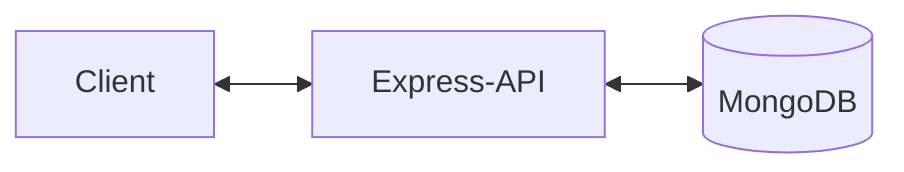
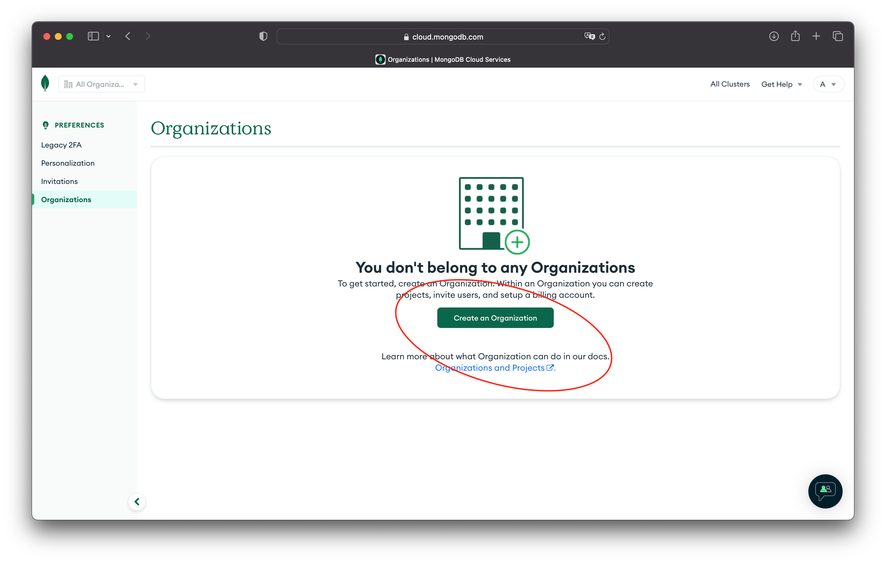
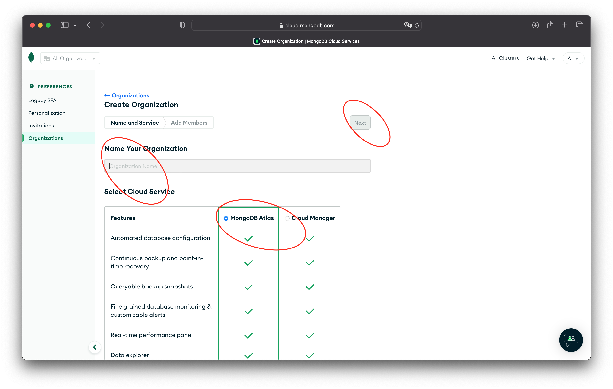
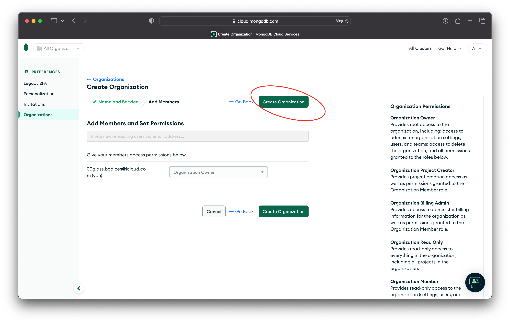
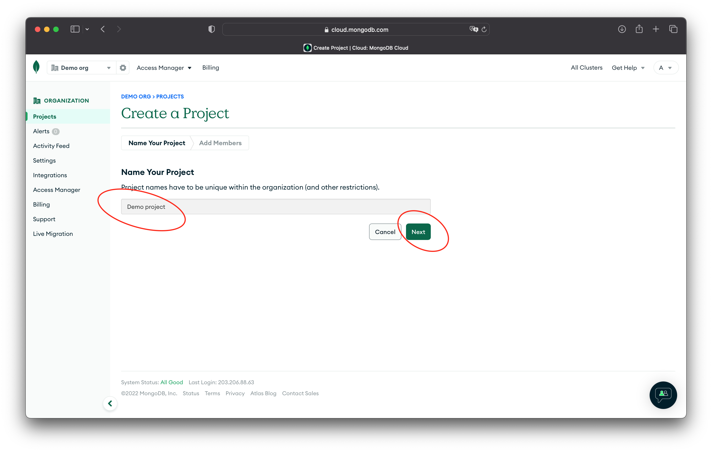
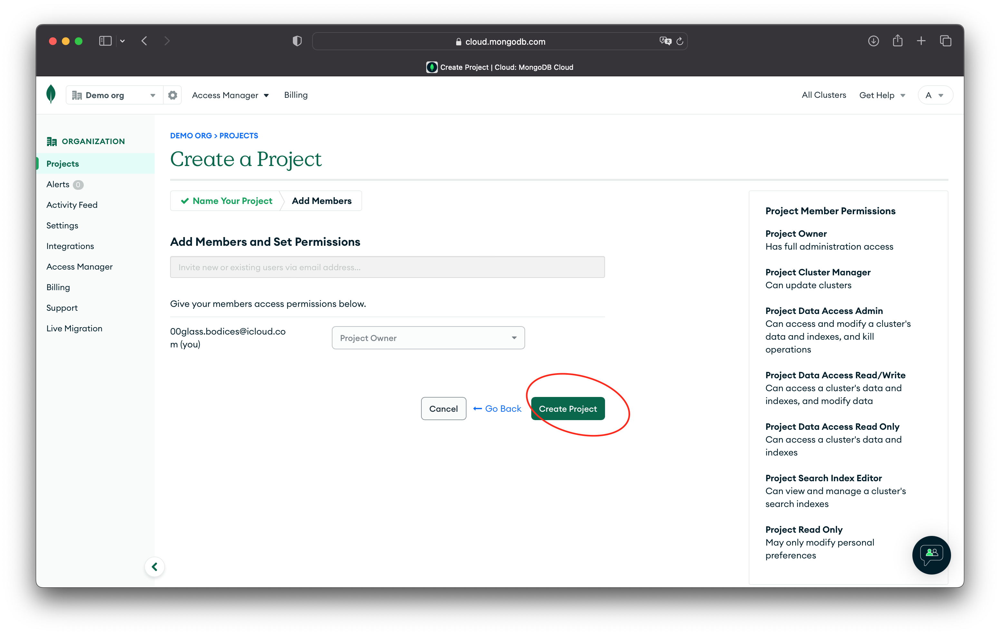

# Creating an API with Express and MongoDB

## Audience

This article is intended for beginners looking to set up their first API using Express and MongoDB. Approaches in this article have been simplified to make then easier to learn. You shouldn't use these steps to produce a production level app.

## Overview

This article will guide you though setting up a simple API using Express and MongoDB. We'll create two endpoints, one for reading all data and one for adding new data.

A high-level overview of what we're going to build is shown below.



The client can be anything that will communicate with our API. It could be a web browser, Postman app, cURL terminal app or your own custom app.

Express is our API code running on a server with internet access. The client can only  read and write data through our API.

MongoDB is our database, storing data for our API.

## MongoDB

We're going to start by creating our database and work accross the diagram above from right to left. 

To keep things simple we're not going to get into details of how to setup and manage a databse server. Instead, MongoDB.com offers free hosting of MongoDB databases that fit our needs.

### Creating and setting up an account

👉Head over to [Cloud: MongoDB Cloud](https://account.mongodb.com/account/register) and register to create a free account. If you already have an account you can skip to **Creating a database**.

💡Once you sing in using your new account for the first time you may need to create an organisation and project. If you already have an organisation and project you want to use you can skip to **Creating a database**.

👉Create an organisation by pressing the "Create an Organisation" button.



👉Enter an organisation name, choose the "MongoDB Atlas" type and press "Next".



👉You don't need any additional members or permissions to simply press "Create Organisation".



👉Enter a project name and press "Next".



👉Again you don't need any additional members or permissions to simply press "Create Project".



### Creating a database

# 


## Adding express

We no longer want our code to read and insert data as soon as it is run. Remove the following lines for your code that run our two functions whenever we run our code.

```javascript
readData()
insertData()
```

In the `readData()` function, we no longer want to log the results to the console. Now we want to return the result from the function so that we can include them in a response from our API.

Change the `.forEach` code to look like this

```javascript
results = [] // declare an empty array for our results
await docs.forEach((d) => { // loop through each result
    results.push({ // create an object to represent it, and push it to our results array
        name: d.name,
        score: d.score
    })
})
```

This code creates an array of results rather than logging them to the console.

Now add this line to the end of the `.readData()` function so that the results are returned.

```javascript
return results
```

Next we'll add the Express package to our project. We can do that using `npm` in the terminal by running

```zsh
% npm install express
```

Once Express has been installed, we can start using it in our code. 

Start by creating an empty function called `runServer`

```javascript
const runServer = async () => {

}
```

Next, we want to set up express in our app. Add the following code to the `runServer()` function.

```javascript
const express = require('express') // use the express package
const app = express() // create an express server
const port = 3000 // set the port we want express to listen on
```

Express can handles many different routes. In order to get scored from our database, we can to configure a `/scores` route. Usually, getting data is done using the HTTP `GET` verb. To do this, add the following code to the end of the `runServer()` function.

```javascript
// create an express route that handles a GET request to path /scores
app.get('/scores', async (req, res) => {
    res.send(await readData()) // use the readData() function and return the result as the response
})
```

We have configured our port to listen on port 3000. Now we need to tell Express to start listening. To do this we use the `.listen()` function. Add the following code to the end of the `runServer()` function.

```javascript
// start express and listen on the port set in the port variable
app.listen(port, () => {
    console.log(`Scores API is listening on port ${port}`)
})
```

Before we can test our code, we need to call the `runServer()` function. Do this by adding the following code as the last line in our `index.js` file.

```javascript
runServer()
```

To test our server, run it using the following terminal command

```zsh
% node index.js
```

When the server has started and is listening, should see the following in the console.

```zsh
Scores API is listening on port 3000
```

Send a request to our server using a web browser, Postman or curl in the terminal. The easiest way in by using curl in the terminal. 
In the terminal, use the following command

```zsh
% curl localhost:3000/scores
```

You should see something like the following in the terminal

```zsh
[{"name":"Su","score":200},{"name":"Su Zhang","score":100},{"name":"Su Zhang","score":100},{"name":"Su Zhang","score":100},{"name":"Su Zhang","score":100},{"name":"Su Zhang","score":100}]
```